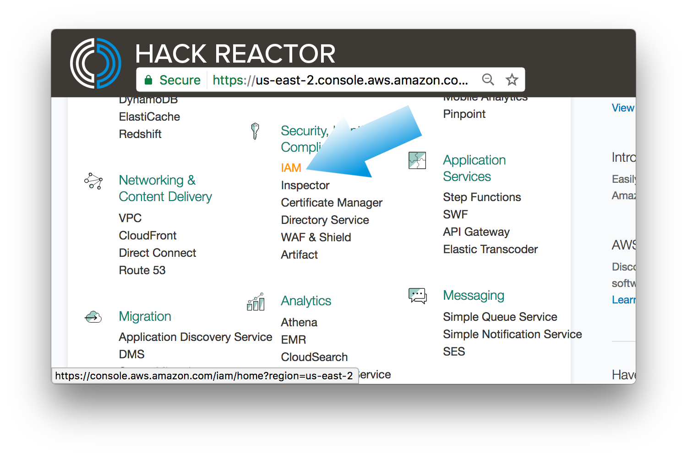
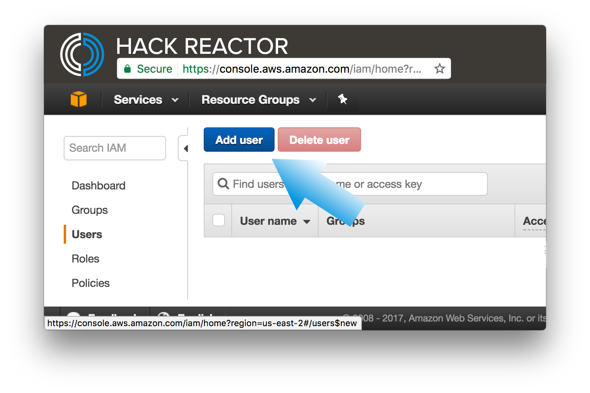
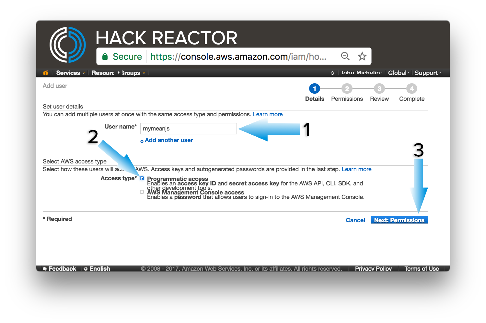
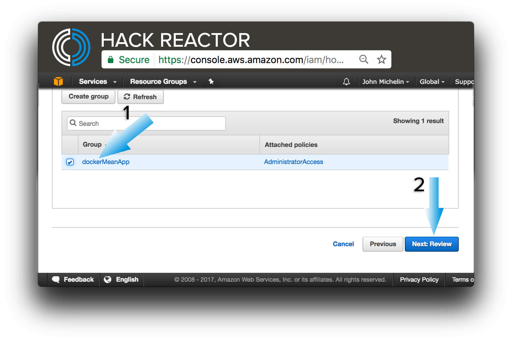
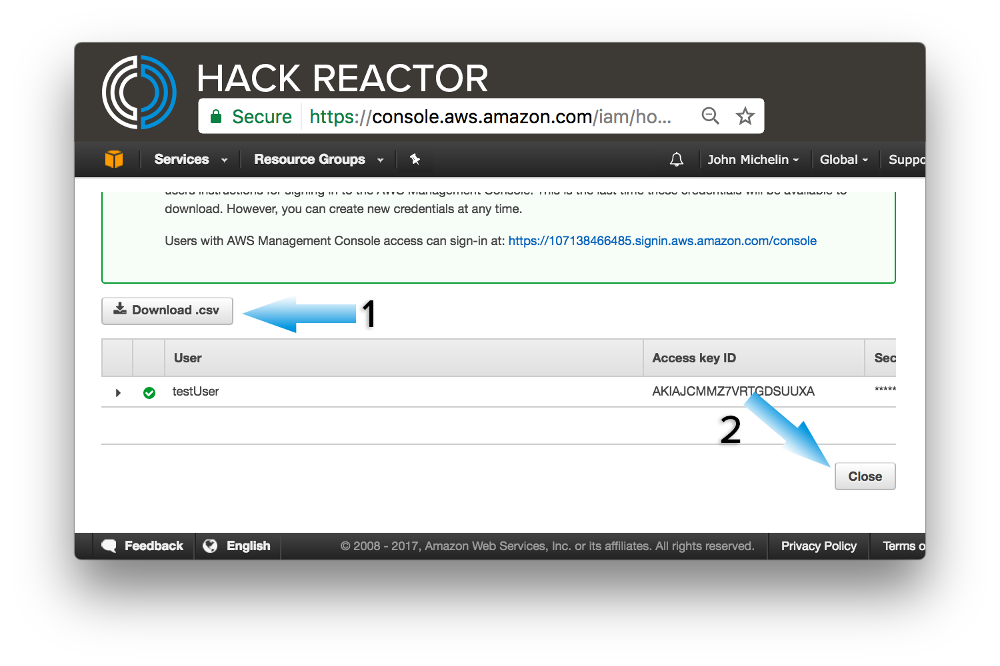

# docker-mean-brownfield
A guide to setting up your docker container on AWS using the MEAN stack

## Project Setup

- [ ] Create an account at [aws.amazon.com](https://aws.amazon.com/ "AWS"). Make sure you sign up for the Basic plan, as that is the free tier.

- [ ] Launch the management console
 
- [ ] Head to IAM so you can create your first user
 
- [ ] Click the `user` menu item on the left to open the user management dashboard
 
- [ ] Click the `Add user` button

- [ ] Enter a user name i.e. meanjs and check Programmatic access and click `Next: Permissions`

 - [ ] Create a group for the user i.e. dockerMeanApp

 - [ ] Set the policy for the group, check `AdministratorAccess` and click `Create group`


- [ ] Review user and group. Verify `Programmatic access` and click `Create user` to continue

- [ ] Download the credentials and click `close`

- [ ] Save credentials to your development machine if it's the first time execute the line below, otherwise just add them
```bash
mkdir ~/.aws && echo -e '[default]\naws_access_key_id = [access key from file]\naws_secret_access_key = [secret key from file]' > ~/.aws/credentials
```
- [ ] Get vpc-id
