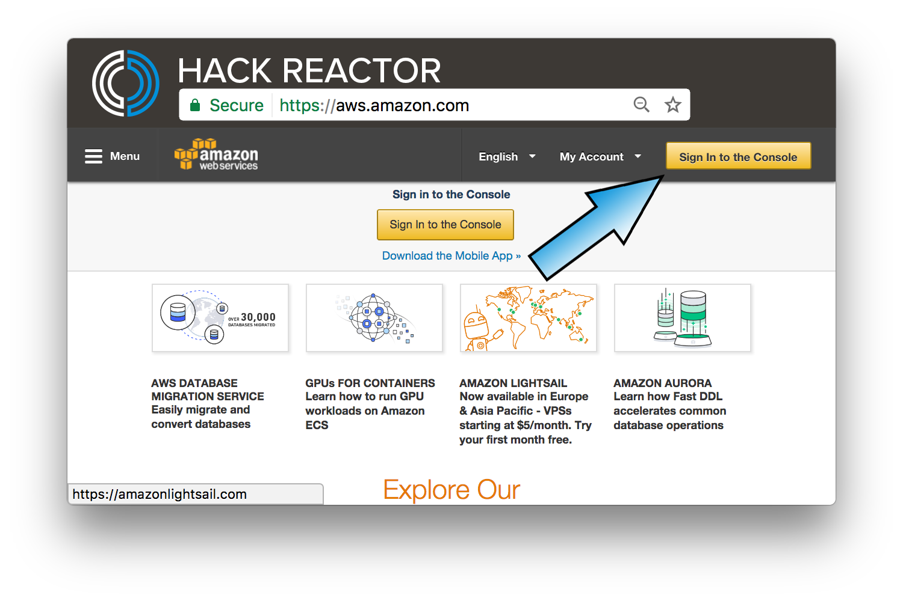
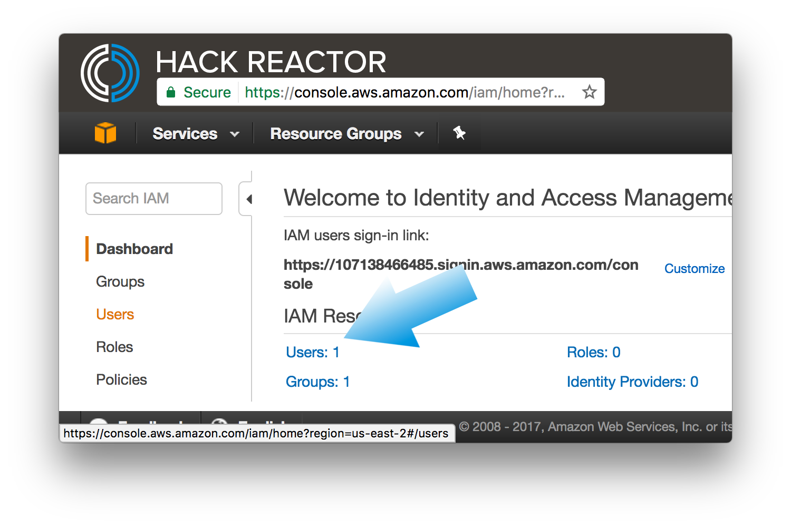

# docker-mean-brownfield
A guide to setting up your docker container on AWS using the MEAN stack

## Project Setup

- [ ] Create an account at [aws.amazon.com](https://aws.amazon.com/ "AWS"). Make sure you sign up for the Basic plan, as that is the free tier.

- [ ] Launch the management console
 
- [ ] Head to IAM so you can create your first user
 
- [ ] Click the `user` menu item on the left to open the user management dashboard
 
 
