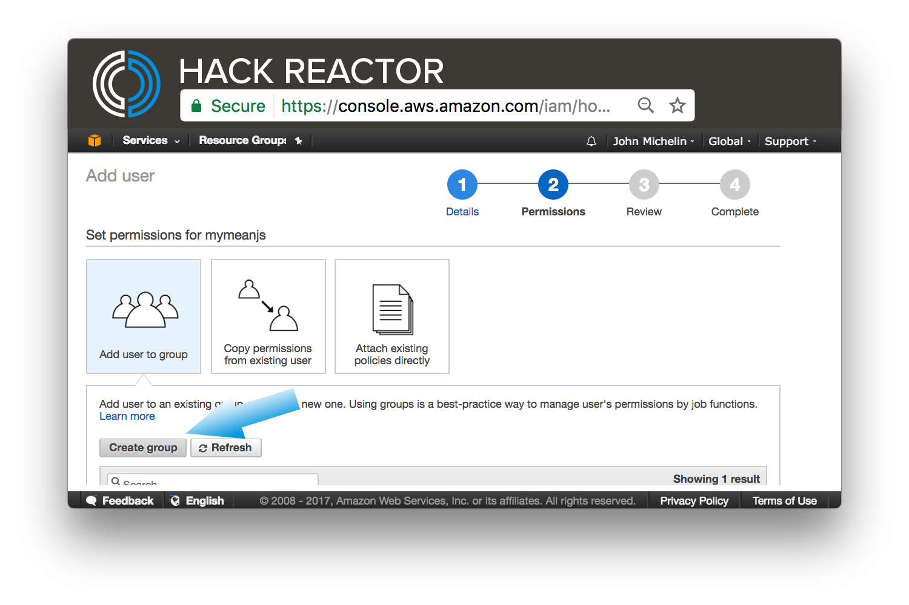
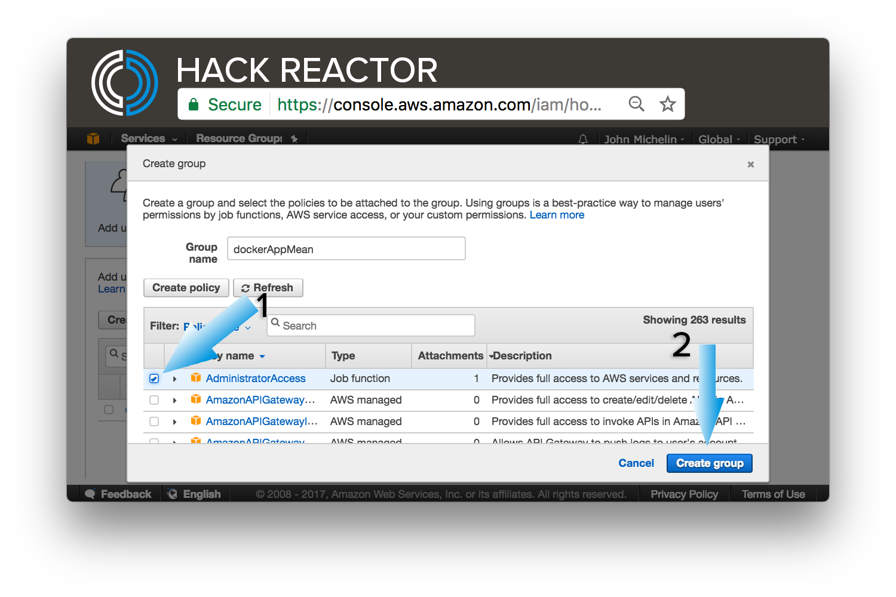
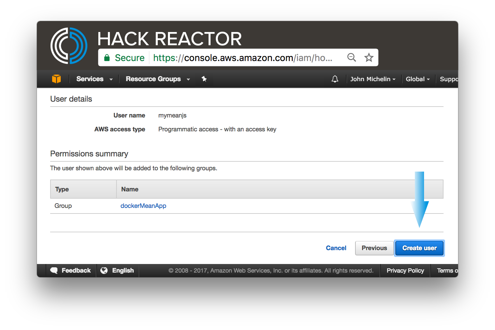
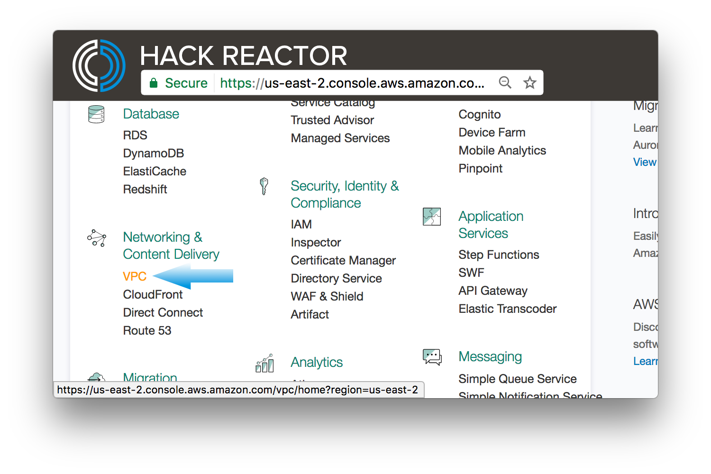
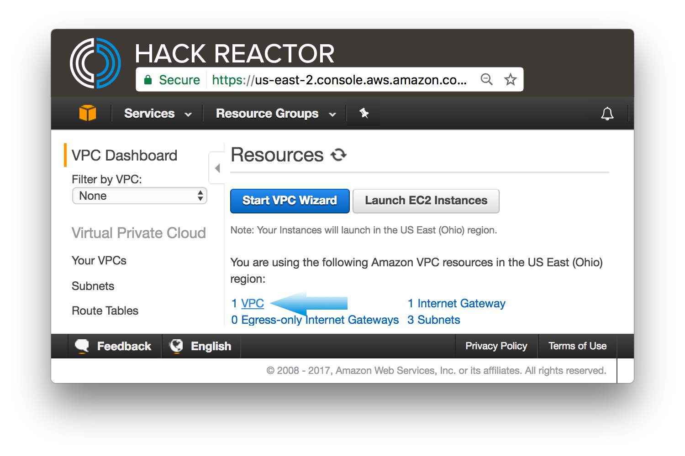
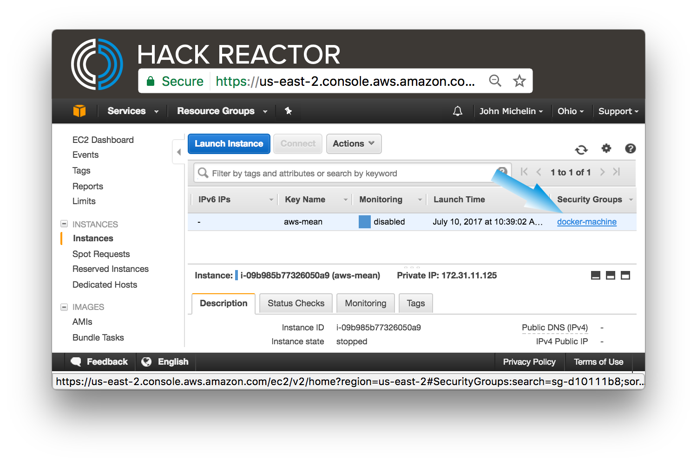
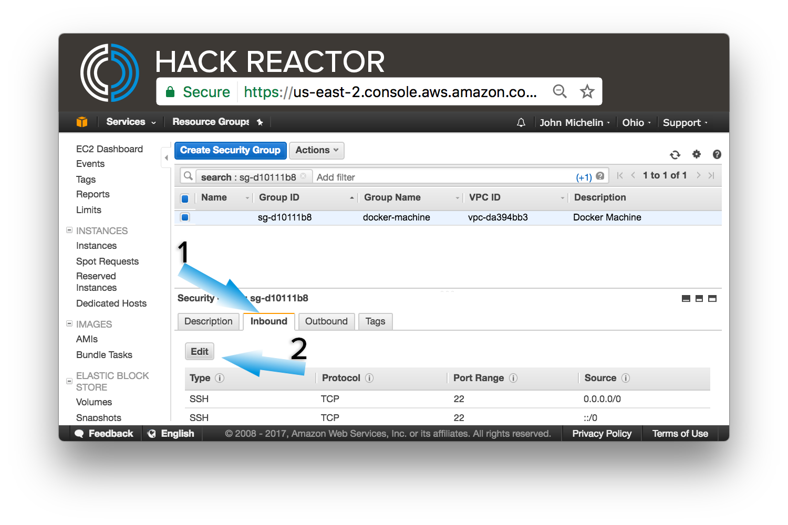
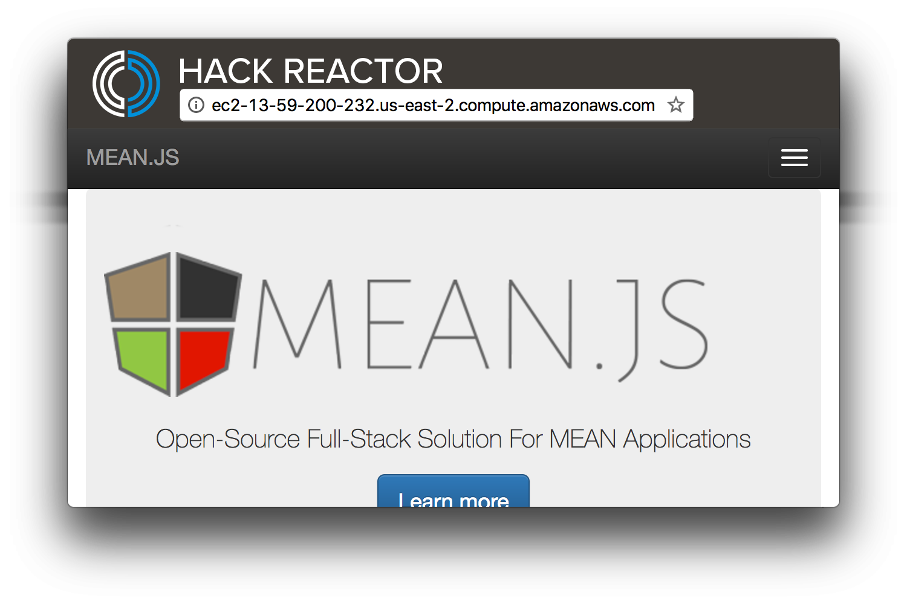

# docker-mean-brownfield
A guide to setting up your docker container on AWS using the MEAN stack

## Prerequisite 
- [ ] Docker [docker.com](https://docs.docker.com/engine/installation/ "AWS")
- [ ] GIT
- [ ] AWS CLI

## Project Setup

- [ ] Create an account at [aws.amazon.com](https://aws.amazon.com/ "AWS"). Make sure you sign up for the Basic plan, as that is the free tier.


- [ ] Launch the management console

 

- [ ] Head to IAM so you can create your first user

 

- [ ] Click the `users` menu item on the left to open the user management dashboard

 

- [ ] Click the `Add user` button


- [ ] Enter a user name i.e. meanjs and check Programmatic access and click `Next: Permissions`


 - [ ] Create a group for the user i.e. dockerMeanApp



 - [ ] Set the policy for the group, check `AdministratorAccess` and click `Create group`




- [ ] Review user and group. Verify `Programmatic access` and click `Create user` to continue



- [ ] Download the credentials and click `close`


- [ ] Save credentials to your development machine if it's the first time execute the line below, otherwise just add them
```bash
mkdir ~/.aws && echo -e '[default]\naws_access_key_id = [access key from file]\naws_secret_access_key = [secret key from file]' > ~/.aws/credentials
```

- [ ] Get vpc-id by clicking on VPC from list

- [ ] Click the VPC link under your listing of Amazon VPC resources



We now have everything to fire up a new EC2 instance from a shell on your computer. (use `aws ec2 describe-subnets
` to find your available subnets)
#### useful commands
```bash
aws ec2 describe-regions #(http://docs.aws.amazon.com/cli/latest/reference/ec2/describe-regions.html)
aws ec2 describe-vpcs #(http://docs.aws.amazon.com/cli/latest/reference/ec2/describe-vpcs.html)
aws ec2 describe-availability-zones #(http://docs.aws.amazon.com/cli/latest/reference/ec2/describe-availability-zones.html)
aws ec2 describe-subnets #(http://docs.aws.amazon.com/cli/latest/reference/ec2/describe-subnets.html)
```
- [ ] Take note of your region, verify that you see us-east-# or us-west-# and record the available values, these will inform the `--amazonec2-region` flag below
```bash
$ aws ec2 describe-regions
{
    "Regions": [
        {...},
        {
            "Endpoint": "ec2.us-east-1.amazonaws.com",
            "RegionName": "us-east-1"
        },
        {
            "Endpoint": "ec2.us-east-2.amazonaws.com",
            "RegionName": "us-east-2"
        },
        {
            "Endpoint": "ec2.us-west-1.amazonaws.com",
            "RegionName": "us-west-1"
        },
        {
            "Endpoint": "ec2.us-west-2.amazonaws.com",
            "RegionName": "us-west-2"
        }
    ]
}


```

- [ ] Now we need to verify the vpc-id we grabbed earlier.

```bash
$ aws ec2 describe-vpcs
{
    "Vpcs": [
        {
            "VpcId": "vpc-da394bb3",
            "InstanceTenancy": "default",
            "State": "available",
            "DhcpOptionsId": "dopt-b5ed95dc",
            "CidrBlock": "172.31.0.0/16",
            "IsDefault": true
        }
    ]
}

```

- [ ] Now we need to verify our availability zones. Take note of the letter at the end of the zone name. This will inform the `--amazonec2-zone` flag below.

```bash
$ aws ec2 describe-availability-zones
{
    "AvailabilityZones": [
        {
            "State": "available",
            "ZoneName": "us-east-2a",
            "Messages": [],
            "RegionName": "us-east-2"
        },
        {
            "State": "available",
            "ZoneName": "us-east-2b",
            "Messages": [],
            "RegionName": "us-east-2"
        },
        {
            "State": "available",
            "ZoneName": "us-east-2c",
            "Messages": [],
            "RegionName": "us-east-2"
        }
    ]
}

```

```bash
$ docker-machine create --driver amazonec2 --amazonec2-region us-east-2 --amazonec2-vpc-id vpc-da394bb3 --amazonec2-zone a aws-mean
Running pre-create checks...
Creating machine...
(aws01) Launching instance...
Waiting for machine to be running, this may take a few minutes...
Detecting operating system of created instance...
Waiting for SSH to be available...
Detecting the provisioner...
Provisioning with ubuntu(systemd)...
Installing Docker...
Copying certs to the local machine directory...
Copying certs to the remote machine...
Setting Docker configuration on the remote daemon...
Checking connection to Docker...
Docker is up and running!
To see how to connect your Docker Client to the Docker Engine running on this virtual machine, run: docker-machine env aws-mean
```

# Error
You may see the following error:
```bash
Running pre-create checks...
Creating machine...
(aws-mean) Launching instance...
Waiting for machine to be running, this may take a few minutes...
Detecting operating system of created instance...
Waiting for SSH to be available...
Detecting the provisioner...
Provisioning with ubuntu(systemd)...
Installing Docker...
Copying certs to the local machine directory...
Copying certs to the remote machine...
Setting Docker configuration on the remote daemon...
Checking connection to Docker...
Error creating machine: Error checking the host: Error checking and/or regenerating the certs: There was an error validating certificates for host "52.15.254.241:2376": dial tcp 52.15.254.241:2376: getsockopt: connection refused
You can attempt to regenerate them using 'docker-machine regenerate-certs [name]'.
Be advised that this will trigger a Docker daemon restart which might stop running containers.
```

- [ ] Verify that you can ssh into the machine
```bash
$ docker-machine ssh aws-mean

#once connected

ubuntu@aws-mean:~$ sudo apt-get update
ubuntu@aws-mean:~$ sudo apt-get upgrade
ubuntu@aws-mean:~$ sudo apt-get upgrade
??ubuntu@aws-mean:~$ sudo apt-get install docker


```

Once everything has settled we must instruct docker to execute on our new EC2.
```bash
$ eval $(docker-machine env aws-mean)
```

#launching mongo

First we must pull the image down and run it on a detached container. The `--name` command sets the instance name. 
The `-d` flag runs it in detached mode, and the `mongo` tells docker what image we want to use. 

```bash
$ docker run --name mymongodb -d mongo
```

#grab and launch the mean stack in a docker

```bash
docker run -i -t --name mymeanjs --link mymongodb:db_1 -p 80:3000 maccam912/meanjs:latest bash
```


Breakdown of above command:
1. -i = Keep STDIN open even if not attached (http://stackoverflow.com/questions/22272401/what-does-it-mean-to-attach-a-tty-std-in-out-to-dockers-or-lxc)
2. -t = Allocate a pseudo-tty
3. --name = names this instance
4. --link = Add link to another container (<name or id>:alias or <name or id>)
5. -p = expose instance port and set up port mapping hostPort:containerPort
6. maccam912/meanjs:latest is the mean stack image

You should see something like `root@2134h4238241:/#`
Type `ls` and you will see a `Development` folder, this is where we will hold our source code.
```bash
$ cd Development #change to Development directory
$ git clone https://github.com/meanjs/mean.git meanjs #grab the latest meanjs stack
$ cd meanjs
$ ls #verify the clone
$ npm install -g n #install n to manage node versions https://github.com/tj/n
$ n 6 #or whatever version of node you are using
$ npm i
$ bower install --allow-root

```

# Security on our instance
- [ ] Open EC2 console. 
- [ ] Find your instance. In our case it will be named aws-mean.
- [ ] Scroll to the right and you will see `Security Groups` click on it, in our case it is `docker-machine` 



- [ ] Select the inbound tab. We are going to be adding HTTP to the rules, along side the SSH that is already there.
- [ ] Click edit and then Add



- [ ] Find the public address and head there in your browser. 


- [ ] If you see the splash page you're ready to get started!



